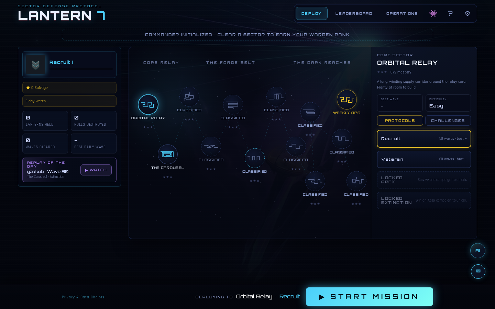

# Lantern 7



[](https://neon-vector-defense-7.web.app)
[](https://www.typescriptlang.org/)
[](https://react.dev/)
[](https://vite.dev/)

Lantern 7 is a sci-fi tower defense game built with React,
TypeScript, and Canvas. It plays like a fast arcade defense game, but the
interesting engineering is under the surface: procedural canvas rendering,
headless balance simulations, bot playtests, local progression, generated art,
procedural audio, and Firebase-backed leaderboards.

**Live game:** [neon-vector-defense-7.web.app](https://neon-vector-defense-7.web.app)  
**Recruiter demo:** [neon-vector-defense-7.web.app/?demo=1](https://neon-vector-defense-7.web.app/?demo=1)

## Gameplay

- **12 sectors on an interactive starmap** — a Sector Atlas constellation
  spanning three regions (Core Relay, The Forge Belt, The Dark Reaches), each
  sector with a custom lane shape, no-build zones, mastery stars, and visual
  theme, unlocked along a sequential campaign chain.
- **4 protocols** — Recruit, Veteran, Apex, and Extinction, with
  different cash, hull, wave, cloak, and scaling rules.
- **Gauntlet Protocol** — a weekly-seeded three-leg roguelite run: cores and a
  portion of credits carry between legs, seeded relic drafts between maps,
  first death ends the run, per-leg replays chained on the leaderboard.
- **Weekly ops** — a Weekly Mutation with stacked rule twists and a
  Champion's Gauntlet where everyone races the crowned champion's run.
- **21 towers with 2 upgrade tracks** — including support, crowd-control,
  anti-cloak, burst, drone, missile, gravity, resonance, targeting, and
  late-game towers.
- **6 commander abilities** — Q/W/E/R/T/Y abilities for orbital strikes, slow
  fields, overdrive, emergency salvage, and late-run control tools.
- **Enemy variants** — armored, blast-proof, cryo-proof, phase-cloaked, repair,
  boss, and nested-hull units.
- **Progression** — service records, tower unlocks, freeplay, recovered signal
  fragments, and cosmetic rewards persist locally.
- **Meta loop** — Warden Rank, Salvage wallet, daily/weekly Operations Board
  quests, and Watch Streak (cosmetic/QoL only — never affects run balance).
- **In-run QoL** — build-phase wave preview, keyboard placement, tower cycling,
  and Veteran Deploy batch upgrades for repeat runs.
- **Battle Plan replays** — watch any run via `/?run=<runId>`; replays are
  ~5KB packed action streams re-simulated frame-accurately by the real engine
  in the viewer, with budgeted seeks for lag-free scrubbing of 25-minute runs
  and a cosmetic reconstruction fallback for legacy/partial records.
- **Bot-rival ghosts** — in-run pacing curve compares your cores/cash to the
  bundled rookie/standard/expert bot profiles for the same sector.
- **Leaderboards and feedback** — server-validated Firestore scoreboards and
  anonymous feedback submission. Scores require a matching public replay and are
  ordered by server time.
- **AI field assistant** — an optional helper backed by the included
  Cloudflare Worker proxy, OpenRouter, and server-side usage limits.

## The Game World

Humanity strung lighthouse relays, called Lanterns, across deep space. They
carry the Continuity: backed-up minds of every colonist who ever crossed. The
Vex Combine armada besieging them is not truly invading; it is a
self-replicating logistics fleet still executing a siege order from a war that
ended 284 years ago. You are the Warden of Lantern Seven. Hold the lane and
follow the recovered signal fragments.

## Technical Highlights

- **Canvas renderer** - vector-style enemy and tower art drawn to supersampled
  offscreen canvases, then animated with recoil, glow, shake, trails, vignettes,
  and damage effects.
- **Deterministic headless engine** - seeded RNG and a fixed timestep make
  every run bit-reproducible; the same game model powers live play, bot
  playtests, balance simulations, performance harnesses, and admin analytics.
- **Server-side anti-cheat** - submitted scores are re-simulated inside Cloud
  Functions from the packed action stream and verified against canonical
  balance/challenge snapshots before a run is trusted on the leaderboard.
- **Remote balance config** - optional Firestore `config/balance` doc hot-patches
  tower, enemy, protocol, income, and global multipliers from the admin console
  without a redeploy.
- **Balance harness** - `npm run balance` simulates map/protocol/bot matrices,
  tower efficiency, strategy viability, solo-tower runs, and writes an in-app
  `balance-report.json`.
- **Bot simulation** - `npm run sim` runs rookie, standard, and expert bot
  tiers through the public game API to keep difficulty targets honest.
- **Procedural audio + generated score** - layered synth effects for core
  combat, plus generated music packs, sector ambience, stingers, and announcer
  lines from `public/audio/`.
- **Generated art pipeline** - optional scripts generate menu, sector,
  briefing, victory, defeat, and archive images through OpenRouter image
  models.
- **Firebase integration** - the Firebase SDK handles anonymous player auth,
  public leaderboard reads, validated score/feedback/telemetry writes, and
  admin-only feedback and telemetry reads.

## Recruiter Demo

Append `?demo=1` to the live URL to launch a no-persistence demo session:

```txt
https://neon-vector-defense-7.web.app/?demo=1
```

Watch a Battle Plan replay:

```txt
https://neon-vector-defense-7.web.app/?run=r_<runId>
```

Demo mode unlocks all sectors, protocols, and towers for that browser session.
It skips telemetry and disables score submission so recruiter exploration does
not pollute production data.

## Local Development

```bash
npm install
npm run dev
```

Useful scripts:

```bash
npm run build      # typecheck and production build
npm run preview    # preview the built app
npm run sim        # full headless bot simulation
npm run sim -- quick
npm run balance    # write public/balance-report.json for the admin dashboard
npm run balance -- quick
npm run perf       # headless engine stress timing
npm run perf:browser  # live FPS sampling via /?perf= route
npm run meta:sim   # guard that meta.ts stays off the score/engine path
npm run test:engine # engine/unit correctness tests
npm run test:security # rules, worker, and Functions security suite
npm run ci         # local approximation of the GitHub Actions gate
npm run check:deploy-env  # verify Node, Java, and Firebase project before emulator/deploy work
```

`public/balance-report.json` is intentionally committed as demo/admin dashboard
data generated from the balance harness, not as production telemetry.

## Generated Art

Generated art lives in `public/art/`; generated audio lives in `public/audio/`.
The committed set is trimmed to assets the current runtime or lore data can
reach: map thumbnails, ability icons, rank crests, rival portraits, result and
briefing art, fragment art, music packs, ambience, stingers, briefing audio, and
announcer/ability voice lines. Enemies are drawn on canvas, so generated enemy
portrait files are not kept. Regeneration is optional and requires an OpenRouter
key. Keep keys in `.env.local`, which is gitignored.

```powershell
$env:OPENROUTER_API_KEY="sk-or-..."
node scripts/genart.mjs
```

Generation helpers under `scripts/` are kept when they are wired to npm/CI/deploy
or still describe the current art, audio, music, lore, sector, meta, or ghost
curve pipelines. Obsolete one-off debug and duplicate generation scripts are
removed during cleanup. Some generation scripts also read `.env.local` directly.
Do not commit local key files. Source code and docs are MIT licensed; generated
art/audio are reserved project assets. See
[docs/asset_provenance.md](docs/asset_provenance.md).

## Documentation

| Doc | Contents |
| --- | --- |
| [docs/architecture.md](docs/architecture.md) | Module map, layer model, runtime flow |
| [docs/business_plan.md](docs/business_plan.md) | Strategy, execution order, KPIs, launch gate |
| [docs/tech_spec.md](docs/tech_spec.md) | Firestore schema, Cloud Functions, env vars |
| [docs/decision_log.md](docs/decision_log.md) | Current source-of-truth design decisions |
| [docs/roadmap.md](docs/roadmap.md) | Shipped features and next priorities |
| [docs/idea_backlog.md](docs/idea_backlog.md) | Full 80-idea audit backlog |
| [docs/changelog.md](docs/changelog.md) | Session-by-session change log |
| [docs/performance_audit.md](docs/performance_audit.md) | Engine perf baselines (2026-06-17) |
| [docs/asset_provenance.md](docs/asset_provenance.md) | Media licensing vs MIT source |

## Controls

| Input | Action |
| --- | --- |
| `1`-`9`, `0` | Select a tower to build and enter keyboard placement |
| Arrow keys, `Enter` | Move the placement cursor and build the selected tower |
| Click map | Place tower or collect power-ups |
| Shift-click map | Keep placing the selected tower |
| Click tower | Open upgrade, targeting, stats, lore, and sell panel |
| `Tab` / Arrow keys, `Enter` | Cycle built towers, then focus the upgrade panel |
| `Q` `W` `E` `R` `T` `Y` | Commander abilities |
| Right-click / `Esc` | Cancel placement, aiming, or selection |
| `Space` | Launch the next wave or pause mid-wave |

## Security & Operations

Firebase web keys in client source are public identifiers; the protection
layer is `firestore.rules` plus Cloud Functions. In short:

- Every player write requires anonymous Firebase Auth; leaderboards are public
  read but write-locked — scores enter only through validating Cloud Functions
  that re-simulate the submitted replay server-side before trusting it.
- An unlinked `/admin` console (Google sign-in + email allowlist) handles
  live-ops: balance hot-patches, weekly champion crowning, telemetry, feedback
  triage, and privacy deletions.
- The optional AI helper runs through a rate-limited Cloudflare Worker proxy so
  no model key ever reaches the browser.

Full operator documentation — security rules model, admin console setup, AI
proxy deployment, App Check rollout, and release process — lives in
[docs/runbooks/firebase-operations.md](docs/runbooks/firebase-operations.md).
