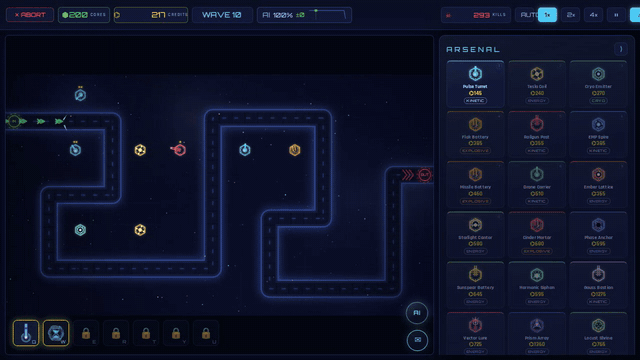
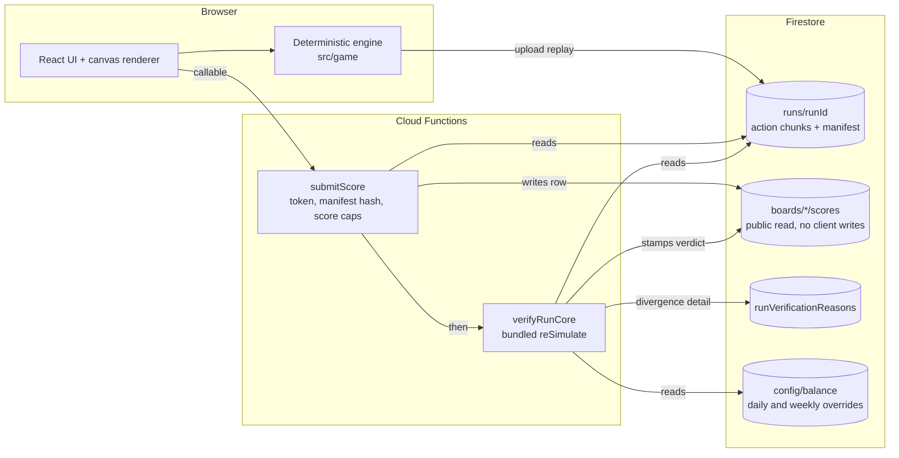

# Neon Vector Defense



<sub>Twelve seconds of wave 10 in demo mode, played by a Playwright script at real
speed and captured headless on a GPU. [MP4 version](docs/hero.mp4).</sub>

Every leaderboard score goes through a Cloud Function, and that function
re-simulates the run with the same engine code the browser ran. A client never
writes a board row. On submit, `processSubmit` in
[`functions/src/index.ts`](functions/src/index.ts) checks the replay token and the
chunk manifest hash, rejects a claim above what the replay summary shows, and
writes the row with the canonical values. `verifyRunCore` then replays the whole action stream through
[`src/game/reSimulate.ts`](src/game/reSimulate.ts), which
`scripts/bundle-resim.mjs` bundles into the Functions build, and stamps the row
`verified`, `divergent` or `unverifiable`. The three-leg Gauntlet Protocol board
goes further: every leg has to come back `verified` before its row is written.
On the other boards a `divergent` row is flagged, not removed yet. I staged
enforcement on purpose until I know the false-positive rate
([decision log](docs/decision_log.md)). The tests are
`tests/unit/reSimulate.test.ts` (honest runs verify, tampered summaries and
actions do not) and the emulator suite in `tests/callables/callables-emulator.test.ts`,
which covers post-accept verification and forged setup snapshots.

The game is titled Lantern 7 in the UI; the repo keeps its working name.

[](https://neon-vector-defense-7.web.app)
[](https://www.typescriptlang.org/)
[](https://react.dev/)
[](https://vite.dev/)

Lantern 7 is a sci-fi tower defense game: 16 sectors on a starmap, 4 difficulty
protocols, 21 towers with two upgrade tracks each, and commander abilities on
the Q through Y keys. It plays like a fast arcade defense game. The reason it
exists as a portfolio piece is what sits under the surface.

The whole game is one deterministic simulation. Seeded RNG plus a fixed timestep
make every run bit-reproducible, so the same engine code runs the live game in
your browser, replays it in the viewer, re-simulates it inside a Cloud Function
to decide whether a leaderboard score is real, plays it headlessly against bots
to check balance, and runs it under a perf harness with no renderer attached.
That constraint drives most of the design decisions here, and it is the rule the
repo protects: a change is not done if it makes the visible game disagree with a
replay or a verifier.

**Live game:** [neon-vector-defense-7.web.app](https://neon-vector-defense-7.web.app)  
**Recruiter demo:** [neon-vector-defense-7.web.app/?demo=1](https://neon-vector-defense-7.web.app/?demo=1)

## What that buys you

**Replays that are not videos.** A finished run is a packed action stream, about
5KB, not a recording. The viewer at `/?run=<runId>` re-simulates it with the
real engine and seeks in budgeted chunks so scrubbing a 25-minute run does not
lock the tab. Old or partial records fall back to a cosmetic reconstruction
instead of failing.

**Anti-cheat that does not trust the client.** Submitted scores go through Cloud
Functions. A score with no matching public replay does not land. The row is
written with canonical values and a server timestamp, then the function replays
the action stream server-side against authenticated balance and challenge
snapshots and records the verdict on the row. Firestore rules make leaderboards
public-read and write-locked; nothing but a validating function writes them.

**Balance you can measure instead of argue about.** `npm run sim` runs rookie,
standard, and expert bots through the public game API across the map and
protocol matrix. `npm run balance` turns that into tower efficiency, solo-tower
viability, and strategy-matrix numbers, and writes `public/balance-report.json`
for the admin dashboard. `npm run balance:gate` diffs a fresh run against that
committed baseline, which is how a balance change gets caught before it ships.
The same bot profiles feed the in-run rival pacing curve.

**Live balance patches without a redeploy.** An optional Firestore
`config/balance` doc overrides tower, enemy, protocol, income, and global
multipliers, edited from the unlinked `/admin` console.

Rendering and audio are procedural. Enemies and towers are vector art drawn to
supersampled offscreen canvases and then animated with recoil, glow, shake,
trails, and damage effects; combat sound is layered synth. Generated art and
music packs are committed under `public/art/` and `public/audio/`, with the
generation scripts optional and key-gated.

Progression, unlocks, and the cosmetic meta loop (Warden Rank, a Salvage wallet,
Operations Board quests) live in `localStorage`. `meta.ts` is fenced off from
combat math, unlocks, bot plans, and score on purpose, and `npm run meta:sim` is
the guard that keeps it there.

## How the pieces fit


```mermaid
flowchart LR
  subgraph Browser
    E[Deterministic engine<br/>src/game]
    UI[React UI + canvas renderer]
    UI --> E
  end
  subgraph Firestore
    R[(runs/runId<br/>action chunks + manifest)]
    B[(boards/*/scores<br/>public read, no client writes)]
    V[(runVerificationReasons)]
    C[(config/balance<br/>daily and weekly overrides)]
  end
  subgraph Functions[Cloud Functions]
    S[submitScore<br/>token, manifest hash, score caps]
    RS[verifyRunCore<br/>bundled reSimulate]
  end
  E -- upload replay --> R
  UI -- callable --> S
  S -- reads --> R
  S -- writes row --> B
  S -- then --> RS
  RS -- reads --> R
  RS -- reads --> C
  RS -- stamps verdict --> B
  RS -- divergence detail --> V
```

## How it was built

Agents wrote most of the code under my direction. The git history shows it: 178
of the 385 commits carry a Claude or Codex co-author trailer. I set the
direction and made the product calls. Those live in
[docs/decision_log.md](docs/decision_log.md), and the cuts live in
[docs/changelog.md](docs/changelog.md), like pulling Signal Skins and the wave
preview in September because they were glitchy.

The agents did not get to grade their own work. The repo contract makes them run
the checks for whatever they touched before a commit. `npm run ci` chains all
of them: a type check and build, the Playwright suite, the engine unit tests,
record-and-replay matching (`test:replay-e2e`), the `meta.ts` fence, a perf
smoke test, the balance drift gate, and the Firestore rules, Worker and
Functions suites against the emulators. `.github/workflows/ci.yml` runs the same
list except the replay matching step. Deploys stay with me.

## The game world

Humanity strung lighthouse relays, called Lanterns, across deep space. They
carry the Continuity: backed-up minds of every colonist who ever crossed. The
Vex Combine armada besieging them is not truly invading; it is a
self-replicating logistics fleet still executing a siege order from a war that
ended 284 years ago. You are the Warden of Lantern Seven. Hold the lane and
follow the recovered signal fragments.

## Running it

```bash
npm install
npm run dev
```

Node 20 or newer. The game runs without any Firebase config; leaderboards,
feedback, and the AI helper are the parts that need it.

| Command | What it does |
| --- | --- |
| `npm run build` | Typecheck and production build |
| `npm run preview` | Serve the built app |
| `npm test` | Playwright end-to-end suite |
| `npm run test:engine` | Engine and unit correctness tests |
| `npm run test:replay-e2e` | Record and re-simulate runs, assert they match |
| `npm run sim` (`sim -- quick`) | Headless bot playtests |
| `npm run balance` (`balance -- quick`) | Balance harness, writes `public/balance-report.json` |
| `npm run balance:gate` | Balance diff against the committed baseline |
| `npm run perf` / `perf:browser` | Headless engine timing / live FPS sampling |
| `npm run meta:sim` | Assert `meta.ts` stays off the engine and score path |
| `npm run test:security` | Firestore rules, Worker, and Functions suites |
| `npm run check:deploy-env` | Check Node, Java, and Firebase project before emulator work |
| `npm run ci` | Everything above, in the order CI runs it |

`test:security` needs the Firebase emulators and Java, so run
`check:deploy-env` first. `public/balance-report.json` is committed on purpose:
it is harness output that feeds the admin dashboard, not production telemetry.

## URL flags

| URL | Behavior |
| --- | --- |
| `/?demo=1` | Recruiter demo: all sectors, protocols, and towers unlocked for the session, no persistence, no telemetry, no score submit |
| `/?run=r_<runId>` | Battle Plan replay viewer |
| `/?perf=<map>&diff=<diff>` | Browser perf harness |
| `/admin` | Owner console, Google sign-in plus an email allowlist |

## Controls

| Input | Action |
| --- | --- |
| `1`-`9`, `0` | Select a tower to build and enter keyboard placement |
| Arrow keys, `Enter` | Move the placement cursor and build the selected tower |
| Click map | Place tower or collect power-ups |
| Shift-click map | Keep placing the selected tower |
| Click tower | Open upgrade, targeting, stats, lore, and sell panel |
| `Tab` / Arrow keys, `Enter` | Cycle built towers, then focus the upgrade panel |
| `Q` `W` `E` `R` `T` `Y` | Commander abilities |
| Right-click / `Esc` | Cancel placement, aiming, or selection |
| `Space` | Launch the next wave or pause mid-wave |

## Docs

| Doc | Contents |
| --- | --- |
| [docs/architecture.md](docs/architecture.md) | Module map, layer model, runtime and replay flow |
| [docs/tech_spec.md](docs/tech_spec.md) | Firestore schema, Cloud Functions, env vars |
| [docs/decision_log.md](docs/decision_log.md) | Source-of-truth design decisions |
| [docs/roadmap.md](docs/roadmap.md) | Shipped features and next priorities |
| [docs/idea_backlog.md](docs/idea_backlog.md) | The full 80-idea audit backlog |
| [docs/changelog.md](docs/changelog.md) | Session-by-session change log |
| [docs/performance_audit.md](docs/performance_audit.md) | Engine perf baselines (2026-06-17) |
| [docs/asset_provenance.md](docs/asset_provenance.md) | Media licensing versus MIT source |

Operator procedures, meaning the security rules model, admin console setup, AI
proxy deployment, App Check rollout, and the release process, live in
[docs/runbooks/](docs/runbooks/), starting with
[firebase-operations.md](docs/runbooks/firebase-operations.md).

## Keys and licensing

Firebase web keys in client source are public identifiers. The protection layer
is `firestore.rules` plus the Cloud Functions, not key secrecy. The optional AI
field assistant runs through a rate-limited Cloudflare Worker proxy in
`worker/`, so no model key reaches the browser. Art and audio regeneration needs
an OpenRouter key:

```bash
export OPENROUTER_API_KEY="sk-or-..."
node scripts/genart.mjs
```

Local keys belong in `.env.local`, which is gitignored. Do not commit them.

Source code and docs are MIT licensed. The generated art and audio are reserved
project assets, not covered by that license. See
[docs/asset_provenance.md](docs/asset_provenance.md).
